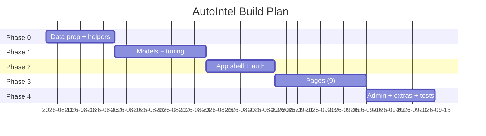
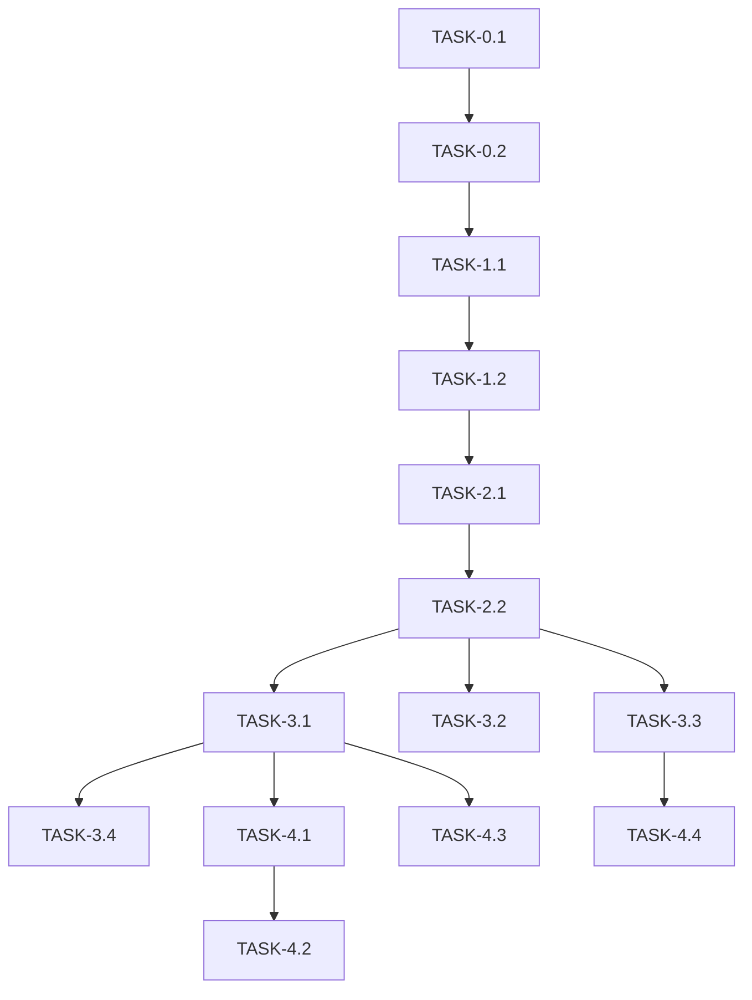

# ImplementationPlan — AutoIntel: Phased Build Plan

| Field | Value |
|---|---|
| Version | v0.1 |
| Last Updated | 2026-08-06 |
| Owner | Engineering Lead |
| Status | In Review |

---

## 1. Build Philosophy

Data → models → app: get the prediction pipeline proven first, then wrap in auth + pages + admin. Model quality (log1p win) is the foundation of everything.

## 2. Phase Overview

## 3. Phase Breakdown

### Phase 0: Data
- Goal: cleaned features + testable helpers.
- Exit: 39 features + log1p.

| TASK-# | Description | Depends on | Owner | Est. | Maps to |
|---|---|---|---|---|---|
| TASK-0.1 | Clean + feature engineering | — | Data | 4d | REQ-002 |
| TASK-0.2 | helpers.py + 65 tests | TASK-0.1 | Eng | 3d | US-001 |

### Phase 1: Models
- Goal: 8 trained + tuned models.
- Exit: benchmarks (R² ≥ 0.76 best).

| TASK-# | Description | Depends on | Owner | Est. | Maps to |
|---|---|---|---|---|---|
| TASK-1.1 | Train 8 models | TASK-0.2 | ML | 4d | REQ-002, REQ-009 |
| TASK-1.2 | GridSearchCV tuning | TASK-1.1 | ML | 4d | REQ-009 |

### Phase 2: App + Auth
- Goal: shell + auth.
- Exit: login/register/forgot work.

| TASK-# | Description | Depends on | Owner | Est. | Maps to |
|---|---|---|---|---|---|
| TASK-2.1 | Streamlit shell + nav | TASK-1.2 | FE | 3d | REQ-001 |
| TASK-2.2 | Auth + roles + JSON store | TASK-2.1 | FE | 3d | REQ-001 |

### Phase 3: Pages
- Goal: 9 pages.
- Exit: all render.

| TASK-# | Description | Depends on | Owner | Est. | Maps to |
|---|---|---|---|---|---|
| TASK-3.1 | Predictor + CI + depreciation | TASK-2.2 | FE | 3d | REQ-002, REQ-003 |
| TASK-3.2 | Dataset + EDA | TASK-2.2 | FE | 2d | REQ-004 |
| TASK-3.3 | Market intelligence | TASK-2.2 | FE | 2d | REQ-005 |
| TASK-3.4 | Model lab + residuals + pipeline | TASK-3.1 | FE | 3d | REQ-009, REQ-010 |

### Phase 4: Extras
- Goal: admin, batch, profile, drift.

| TASK-# | Description | Depends on | Owner | Est. | Maps to |
|---|---|---|---|---|---|
| TASK-4.1 | Admin panel | TASK-3.1 | FE | 3d | REQ-007 |
| TASK-4.2 | Bulk upload → Excel | TASK-4.1 | FE | 2d | REQ-008 |
| TASK-4.3 | Profile history | TASK-3.1 | FE | 2d | REQ-006 |
| TASK-4.4 | Drift simulator | TASK-3.3 | FE | 2d | REQ-011 |

## 4. Dependency Graph

## 5. Environment & Tooling Setup Checklist

- [ ] `pip install -r requirements.txt`
- [ ] Run `prepare_ml_data.py`
- [ ] Run `train_dashboard_models.py`
- [ ] `streamlit run streamlit_app.py`
- [ ] Login with demo/demo123

## 6. Rollout Strategy

- Single-app; demo creds for evaluation.
- Rollback: revert commit + retrain pinned.

## 7. Definition of Done (global)

- [ ] Tests pass (65)
- [ ] Docs updated (this suite)
- [ ] Reviewed
- [ ] No secrets
- [ ] Smoke: predict + auth + pages

## 8. Related Documents

| Document | Relationship |
|---|---|
| [PRD.md](PRD.md) | REQ mapping |
| [TechSpec.md](TechSpec.md) | Components |
| [AppFlow.md](AppFlow.md) | Flows |
| [Schema.md](Schema.md) | Data |
| [Design.md](Design.md) | UI tasks |
| [Tracker.md](Tracker.md) | Status |
| [Rules.md](Rules.md) | Standards |
| [API.md](API.md) | Interfaces |
| [SecurityAndCompliance.md](SecurityAndCompliance.md) | Auth |
| [Testing.md](Testing.md) | Tests |
| [Deployment.md](Deployment.md) | Rollout |
| [Glossary.md](Glossary.md) | Vocabulary |
| [RiskRegister.md](RiskRegister.md) | Risks |
