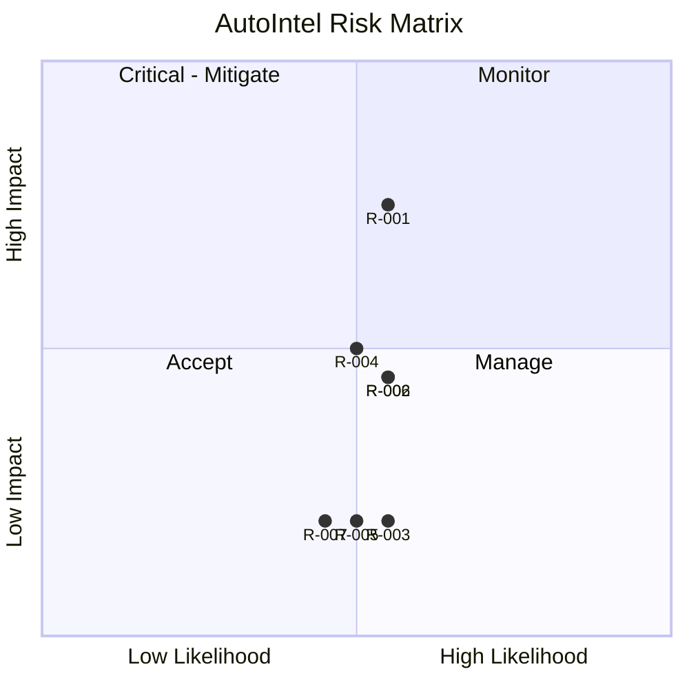

# RiskRegister — AutoIntel: Known Risks

| Field | Value |
|---|---|
| Version | v0.1 |
| Last Updated | 2026-08-06 |
| Owner | PM / Eng Lead |
| Status | In Review |

---

| Risk | Likelihood | Impact | Score | Mitigation | Owner | Status |
|---|---|---|---|---|---|---|
| R-001 Model generalization | Medium | High | 6 | Tuned CV + log1p + 8-model compare | ML | Mitigating |
| R-002 Data staleness (1996–2024) | Medium | Medium | 4 | Documented; drift simulator | Data | Accepted |
| R-003 JSON auth limitations | Medium | Low | 2 | Single-app scale acceptable | Eng | Accepted |
| R-004 Overfitting tuned models | Medium | Medium | 4 | CV + residual analysis | ML | Mitigating |
| R-005 Batch CSV edge cases | Medium | Low | 2 | Validation + skip/report | Eng | Open |
| R-006 No prod deployment | Medium | Medium | 4 | Streamlit Cloud target | DevOps | Open |
| R-007 SVR/KNN scale sensitivity | Medium | Low | 2 | Feature scaling + benchmarks | ML | Accepted |

## Risk Matrix

## Related Documents

| Document | Relationship |
|---|---|
| [PRD.md](PRD.md) | Top-3 risks |
| [TechSpec.md](TechSpec.md) | R-001/004 |
| [SecurityAndCompliance.md](SecurityAndCompliance.md) | Auth risks |
| [AppFlow.md](AppFlow.md) | Flows |
| [Design.md](Design.md) | Design |
| [Schema.md](Schema.md) | Data |
| [ImplementationPlan.md](ImplementationPlan.md) | Mitigations |
| [Tracker.md](Tracker.md) | Status |
| [Rules.md](Rules.md) | Standards |
| [API.md](API.md) | Interfaces |
| [Testing.md](Testing.md) | Test coverage |
| [Deployment.md](Deployment.md) | R-006 |
| [Glossary.md](Glossary.md) | Vocabulary |
