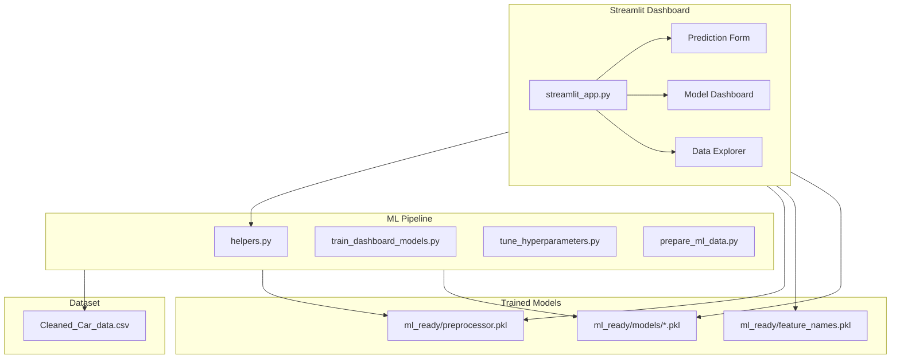

# Price-My-Car — Architecture

## Key Patterns

- **Multiple models compared**: Linear, Ridge, Lasso, KNN, SVR, Random Forest, Gradient Boosting, XGBoost
- **Feature engineering**: Preprocessor pipeline in `ml_ready/preprocessor.pkl`
- **No external API**: Fully local inference — no data sent to external services
- **Notebook generation**: `create_notebook.py` auto-generates Jupyter notebooks from markdown
