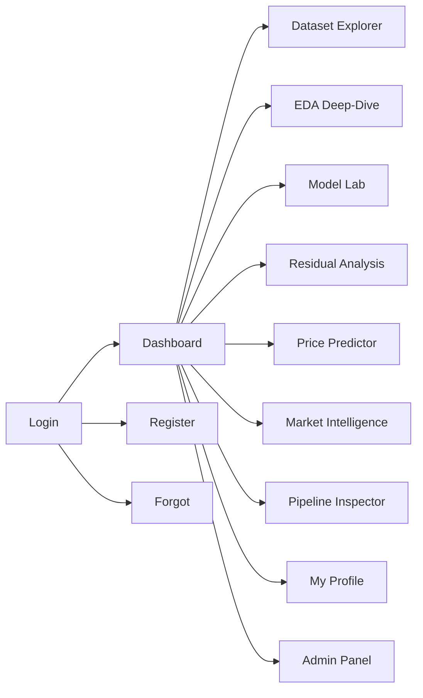
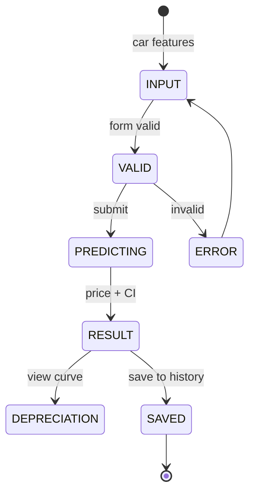
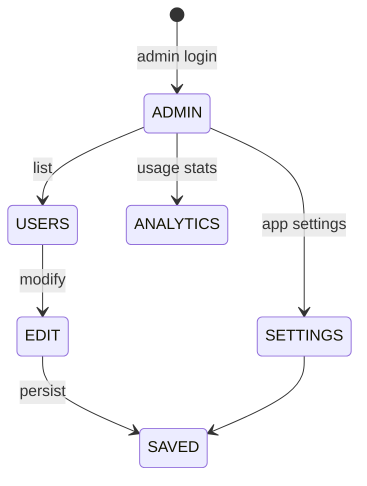

# AppFlow — AutoIntel: Application Flow

| Field | Value |
| --- | --- |
| Version | v0.1 |
| Last Updated | 2026-08-06 |
| Owner | PM / QA |
| Status | In Review |

---

## 1. Screen Inventory

| SCR-### | Screen | Purpose | Entry | Exit | Auth |
| --- | --- | --- | --- | --- | --- |
| SCR-001 | Login | Auth | app start | dashboard | No |
| SCR-002 | Register | Signup | login | login | No |
| SCR-003 | Forgot Password | Reset | login | login | No |
| SCR-004 | Dashboard | Hero, KPIs, Quick Predict | login | all | Yes |
| SCR-005 | Dataset Explorer | Filters + dataframe | nav | — | Yes |
| SCR-006 | EDA Deep-Dive | 5 tabs analysis | nav | — | Yes |
| SCR-007 | Model Lab | Metrics + recommendation | nav | — | Yes |
| SCR-008 | Residual Analysis | Residuals, QQ, calibration | nav | — | Yes |
| SCR-009 | Price Predictor | Predict + CI + depreciation | nav | — | Yes |
| SCR-010 | Market Intelligence | Trends, positioning | nav | — | Yes |
| SCR-011 | Pipeline Inspector | 8-stage diagram | nav | — | Yes |
| SCR-012 | My Profile | History + comparisons | nav | — | Yes |
| SCR-013 | Admin Panel | Users + analytics + settings | nav | — | Admin |

## 2. Navigation Map

## 3. Detailed Flow per Journey

### Predict a price

### Admin manage users

## 4. Empty / Loading / Error States

| Screen | Empty | Loading | Error |
| --- | --- | --- | --- |
| Dataset | "No data" | spinner | CSV missing |
| Predictor | — | calculating | invalid input |
| Profile | "No history yet" | — | — |
| Admin | "No users" | — | auth error |

## 5. Edge Cases & Branching Logic

| IF condition | THEN route |
| --- | --- |
| Invalid login | Error + retry |
| Missing model artifact | Retrain guidance |
| CSV with bad rows | Skip + report |
| Unknown fuel type | Validation error |
| Demo creds | demo/demo123 |

## 6. Notifications & Re-engagement

N/A — no push in v1.

## 7. Cross-Platform Deltas

N/A — web app only.

## 8. Related Documents

| Document | Relationship |
| --- | --- |
| [PRD.md](../product/PRD.md) | US-001…008 |
| [TechSpec.md](../technical/TechSpec.md) | Components |
| [Design.md](Design.md) | Screens |
| [Schema.md](../technical/Schema.md) | Data |
| [ImplementationPlan.md](../project/ImplementationPlan.md) | Tasks |
| [Tracker.md](../project/Tracker.md) | Status |
| [Rules.md](../project/Rules.md) | Standards |
| [API.md](../technical/API.md) | Interfaces |
| [SecurityAndCompliance.md](../technical/SecurityAndCompliance.md) | Auth |
| [Testing.md](../technical/Testing.md) | Tests |
| [Deployment.md](../technical/Deployment.md) | Env |
| [Glossary.md](../reference/Glossary.md) | Vocabulary |
| [RiskRegister.md](../project/RiskRegister.md) | Risks |
