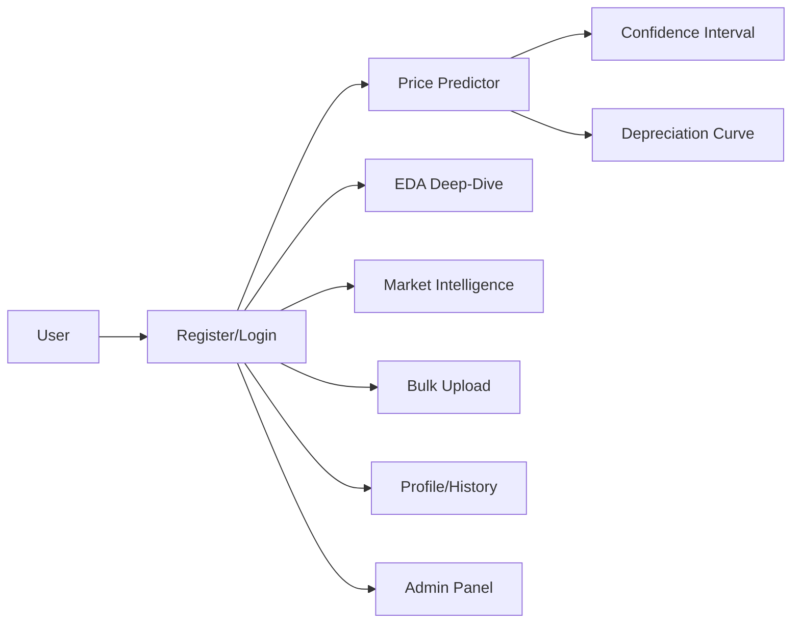

# PRD — AutoIntel (Price-My-Car): Car Price Intelligence Platform

|Field|Value|
|---|---|
|Version|v0.1|
|Last Updated|2026-08-06|
|Owner|Product Manager|
|Status|In Review|

---

## 1. Executive Summary

AutoIntel is a production-ready ML application for predicting used car prices in the Indian market. It trains 8 ML models (Linear Regression, Ridge, XGBoost, Gradient Boosting, SVR, Lasso, KNN, Random Forest), serves a 9-page Streamlit dashboard with authentication and an admin panel, and provides 10 enhanced features: confidence intervals, depreciation curves, EDA deep-dives, market intelligence, bulk CSV prediction, drift simulation, model lab, residual analysis, pipeline inspector, and user profiles. Built on 13,284 Indian used-car listings (11,149 after dedup), 39 engineered features, and a log-transformed target (skew 5.64 → −0.12).

## 2. Problem Statement

- **User pain:** Used-car pricing in India is opaque; sellers and buyers guess.
- **Evidence/context:** 8 models, best Linear Regression R² 0.7654 (RMSE ₹247,535); log transform lifted LR from R² 0.66 → 0.77.
- **Cost of not solving it:** Mis-priced listings, lost value, mistrust in the used-car market.

## 3. Goals & Non-Goals

|Goal|Metric|Target|
|---|---|---|
|Accurate price prediction|R² (best)|≥ 0.76|
|User auth + admin|Roles work|100%|
|Breadth of insight|9 pages + 10 features|shipped|
|Test health|pytest|65 passing|

### Non-Goals (v1)
- Live dealership integrations / listings feeds.
- Real-time price scraping.
- Multi-tenant SaaS (local/single-app).
- Mobile apps (responsive web).

## 4. Target Users & Personas

|Persona|Role|Goals|Frustrations|Quote|Tech Comfort|
|---|---|---|---|---|---|
|Rohit — Car Seller|Prices his car|Fair price|Undervaluation|"What's my car really worth?"|Low|
|Priya — Car Buyer|Evaluates listings|Fair deals|Overpricing|"Is this a good price?"|Medium|
|Aman — Dealer/Admin|Market analytics|Trends + value|Scattered data|"Show me market positioning."|Medium|

## 5. User Stories

|ID|As a...|I want...|So that...|Priority|Acceptance Criteria|
|---|---|---|---|---|---|
|US-001|Seller|predict my car's price|I price it right|P0|Prediction + CI|
|US-002|Buyer|confidence intervals|I gauge certainty|P0|Interval shown|
|US-003|User|bulk CSV predictions|I price many cars|P1|Excel download|
|US-004|User|EDA deep-dive|I understand data|P1|5 tabs|
|US-005|Admin|user management + usage analytics|I run the app|P1|Admin panel|
|US-006|User|profile with history|I keep my predictions|P1|History saved|
|US-007|User|depreciation curve|I plan resale|P1|Curve chart|
|US-008|User|drift simulator|I see time effects|P2|Simulated prices|

## 6. Feature List

|ID|Epic|Feature|Description|Priority|Status|
|---|---|---|---|---|---|
|REQ-001|Auth|Login/signup/forgot|JSON persistence|P0|Done|
|REQ-002|Predict|Price predictor|8 models + CI|P0|Done|
|REQ-003|Predict|Depreciation curve|Resale planning|P1|Done|
|REQ-004|EDA|Deep-dive 5 tabs|Price/brands/correlations/outliers/trends|P1|Done|
|REQ-005|Market|Market intelligence|Trends, heatmaps, positioning|P1|Done|
|REQ-006|Profiles|Prediction history|Saved comparisons|P1|Done|
|REQ-007|Admin|Admin panel|Users, analytics, settings|P1|Done|
|REQ-008|Batch|Bulk upload|CSV → Excel|P1|Done|
|REQ-009|Models|Model lab|Metrics + recommendation|P1|Done|
|REQ-010|Ops|Residual analysis + pipeline inspector|Diagnostic views|P2|Done|
|REQ-011|Sim|Drift simulator|Time-based pricing|P2|Done|

## 7. User Journeys (high level)

## 8. Success Metrics / KPIs

|Metric|Target|Measurement|
|---|---|---|
|North Star: prediction accuracy|R² ≥ 0.76|benchmarks|
|Prediction RMSE|≤ ₹250,000|benchmarks|
|Test health|65 passing|pytest|
|Page coverage|9 pages working|smoke|

## 9. Assumptions & Dependencies

- Cleaned_Car_data.csv bundled.
- Models trained via scripts (tuned params).
- Demo credentials: demo/demo123.

## 10. Risks

Top 3 (full list in ../project/RiskRegister.md):
1. **Model generalization** — mitigated by tuned CV + log transform.
2. **Data staleness (1996–2024)** — documented; drift simulator.
3. **JSON auth limitations** — acceptable for single-app scale.

## 11. Release Criteria

- [ ] All 8 models trained and benchmarked.
- [ ] 9 pages render.
- [ ] Auth + admin panel work.
- [ ] Bulk upload → Excel works.
- [ ] 65 tests pass.

## 12. Open Questions

|Question|Owner|Resolve by|
|---|---|---|
|Move JSON auth to a DB?|Eng Lead|Release 1.1|
|Live market scraping?|PM|Release 2.0|

## 13. Related Documents

|Document|Relationship|
|---|---|
|[TechSpec.md](../technical/TechSpec.md)|Architecture|
|[AppFlow.md](../design/AppFlow.md)|Page flows|
|[Design.md](../design/Design.md)|Design system|
|[Schema.md](../technical/Schema.md)|Data model|
|[ImplementationPlan.md](../project/ImplementationPlan.md)|Build plan|
|[Tracker.md](../project/Tracker.md)|Task status|
|[Rules.md](../project/Rules.md)|Standards|
|[API.md](../technical/API.md)|Interfaces|
|[SecurityAndCompliance.md](../technical/SecurityAndCompliance.md)|Auth|
|[Testing.md](../technical/Testing.md)|Tests|
|[Deployment.md](../technical/Deployment.md)|Deployment|
|[Glossary.md](../reference/Glossary.md)|Vocabulary|
|[RiskRegister.md](../project/RiskRegister.md)|Risks|
