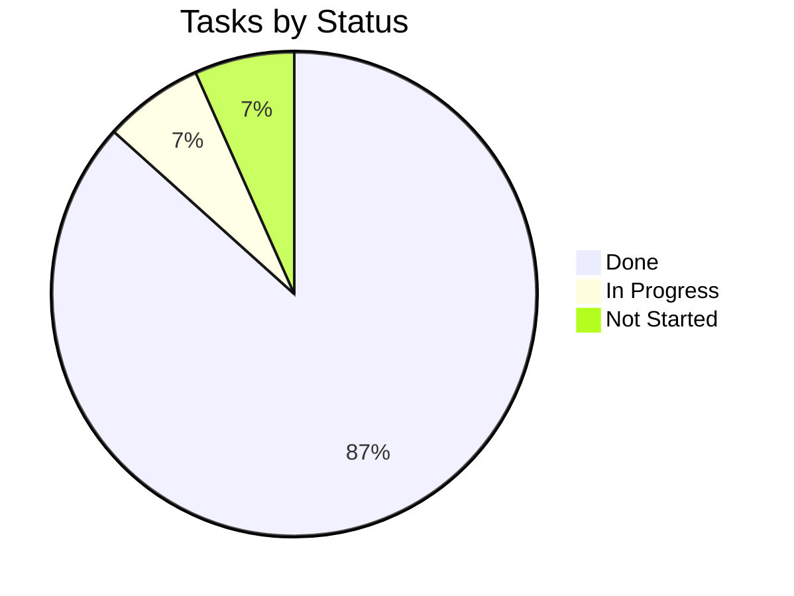

# Tracker — AutoIntel: Living Status Tracker

|Field|Value|
|---|---|
|Version|v0.1|
|Last Updated|2026-08-06|
|Owner|Engineering Lead|
|Status|In Review|

---

## 1. Snapshot Dashboard

|Metric|Value|
|---|---|
|Overall % Complete|85%|
|Current Phase|Phase 4|
|Tasks Done / Total|13 / 15|
|Blockers (open)|0|
|Days to Target Launch|10|

## 2. Status Legend

🟢 Done | 🟡 In Progress | 🔴 Blocked | ⚪ Not Started | 🔵 In Review

## 3. Phase Progress Bars

|Phase|Progress|
|---|---|
|Phase 0: Data|`[████████░░] 100%`|
|Phase 1: Models|`[████████░░] 100%`|
|Phase 2: App + Auth|`[████████░░] 100%`|
|Phase 3: Pages|`[████████░░] 100%`|
|Phase 4: Extras|`[████░░░░░░] 66%`|

## 4. Full Task Table

|TASK|Description|Status|Assignee|Start|Target|Actual|Notes|
|---|---|---|---|---|---|---|---|
|TASK-0.1|Clean + features|🟢|Data|2026-07-01|2026-07-06|—||
|TASK-0.2|helpers + 65 tests|🟢|Eng|2026-07-06|2026-07-09|—||
|TASK-1.1|Train 8 models|🟢|ML|2026-07-10|2026-07-16|—|LR R² 0.7654|
|TASK-1.2|Tuning|🟢|ML|2026-07-16|2026-07-21|—||
|TASK-2.1|App shell|🟢|FE|2026-07-22|2026-07-25|—||
|TASK-2.2|Auth + roles|🟢|FE|2026-07-25|2026-07-28|—||
|TASK-3.1|Predictor + CI|🟢|FE|2026-07-29|2026-08-01|—||
|TASK-3.2|Dataset + EDA|🟢|FE|2026-08-01|2026-08-03|—||
|TASK-3.3|Market intelligence|🟢|FE|2026-08-03|2026-08-05|—||
|TASK-3.4|Model lab + residuals|🟢|FE|2026-08-05|2026-08-08|—||
|TASK-4.1|Admin panel|🟢|FE|2026-08-08|2026-08-11|—||
|TASK-4.2|Bulk upload|🟡|FE|2026-08-11|—|—|in progress|
|TASK-4.3|Profile history|🟢|FE|2026-08-08|2026-08-10|—||
|TASK-4.4|Drift simulator|⚪|FE|—|—|—||

## 5. Blockers Log

|ID|Description|Raised|Owner|Impact|Status|
|---|---|---|---|---|---|
|BLK-001|None open|—|—|—|—|

## 6. Changelog

|Date|What shipped|
|---|---|
|2026-08-06|Docs suite v0.1|
|2026-08-11|Admin panel shipped|

## 7. Burndown Summary

## 8. Next 3 Priorities

1. Finish TASK-4.2 — Bulk upload → Excel.
2. TASK-4.4 — Drift simulator.
3. Final smoke + deploy prep.

## 9. Related Documents

|Document|Relationship|
|---|---|
|[ImplementationPlan.md](ImplementationPlan.md)|Tasks|
|[PRD.md](../product/PRD.md)|Features|
|[TechSpec.md](../technical/TechSpec.md)|Components|
|[AppFlow.md](../design/AppFlow.md)|Flows|
|[Design.md](../design/Design.md)|Design|
|[Schema.md](../technical/Schema.md)|Data|
|[Rules.md](Rules.md)|Standards|
|[API.md](../technical/API.md)|Interfaces|
|[SecurityAndCompliance.md](../technical/SecurityAndCompliance.md)|Auth|
|[Testing.md](../technical/Testing.md)|Tests|
|[Deployment.md](../technical/Deployment.md)|Deploy|
|[Glossary.md](../reference/Glossary.md)|Vocabulary|
|[RiskRegister.md](RiskRegister.md)|Risks|
