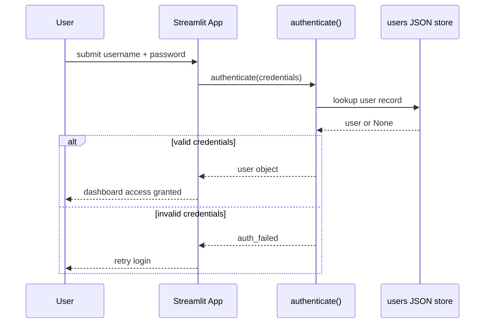

# API — AutoIntel: Interfaces Reference

| Field | Value |
| --- | --- |
| Version | v0.1 |
| Last Updated | 2026-08-06 |
| Owner | Backend Engineer |
| Status | In Review |

---

> No public REST API in v1 — Streamlit app with internal helper contracts.

## 1. Function Contracts (helpers.py)

| Function | Purpose | Input → Output |
| --- | --- | --- |
| `predict_price(features)` | Price prediction | features → price + CI |
| `preprocess_features(raw)` | Feature prep | raw → features |
| `compute_depreciation(price, years)` | Resale curve | price, years → series |
| `authenticate(username, password)` | Auth check | creds → user/None |
| `validate_csv(rows)` | Batch validation | rows → valid/invalid |
| `get_market_stats()` | Market aggregates | — → stats |

## 2. Example: predict_price

```json
{
  "input": { "company": "Honda", "name": "City", "year": 2019, "kms_driven": 45000, "fuel_type": "Petrol" },
  "output": { "price": 845000, "ci_low": 821000, "ci_high": 869000, "model": "linear_regression" }
}
```

## 3. Error Codes

| Code | Meaning | Retry? |
| --- | --- | --- |
| invalid_input | Form/CSV validation | Fix input |
| model_missing | Artifact absent | Run training |
| auth_failed | Bad credentials | Retry login |

## 4. Versioning Policy

- Internal contracts; UI is the only consumer.

## Authentication Flow (session-less credential check)



## 5. Related Documents

| Document | Relationship |
| --- | --- |
| [TechSpec.md](TechSpec.md) | Helpers layer |
| [Schema.md](Schema.md) | Data contracts |
| [AppFlow.md](../design/AppFlow.md) | Flows |
| [PRD.md](../product/PRD.md) | Requirements |
| [Design.md](../design/Design.md) | Rendering |
| [ImplementationPlan.md](../project/ImplementationPlan.md) | Tasks |
| [Tracker.md](../project/Tracker.md) | Status |
| [Rules.md](../project/Rules.md) | Standards |
| [SecurityAndCompliance.md](SecurityAndCompliance.md) | Auth |
| [Testing.md](Testing.md) | Contract tests |
| [Deployment.md](Deployment.md) | Deploy |
| [Glossary.md](../reference/Glossary.md) | Vocabulary |
| [RiskRegister.md](../project/RiskRegister.md) | Risks |
