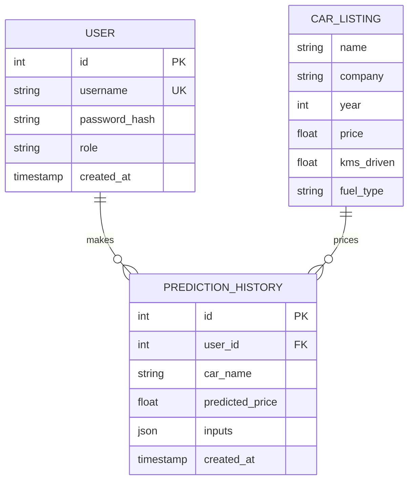

# Schema — AutoIntel: Data Model

|Field|Value|
|---|---|
|Version|v0.1|
|Last Updated|2026-08-06|
|Owner|Data Engineer|
|Status|In Review|

---

## 1. ER Diagram



## 2. Table/Collection Definitions

### TBL-car_listing (dataset)
|Field|Type|Nullable|Default|Constraints|Description|
|---|---|---|---|---|---|
|name|string|No|—|—|car model|
|company|string|No|—|36 unique|brand|
|year|int|No|—|1996–2024|year|
|Price|float|No|—|20k–1Cr INR|price|
|kms_driven|float|No|—|≥ 0|distance|
|fuel_type|enum|No|—|Diesel/Petrol/CNG/LPG/Electric|fuel|

Stats: 13,284 rows; 11,149 after dedup; 39 engineered features; log1p target.

### TBL-user (JSON store)
|Field|Type|Nullable|Default|Constraints|Description|
|---|---|---|---|---|---|
|id|int PK|No|auto|—|PK|
|username|string|No|—|unique|login|
|password_hash|string|No|—|hashed|password|
|role|enum|No|user|user/admin|role|
|created_at|timestamp|No|now()|—|when|

### TBL-prediction_history
|Field|Type|Nullable|Default|Constraints|Description|
|---|---|---|---|---|---|
|id|int PK|No|auto|—|PK|
|user_id|int FK|No|—|→ user|owner|
|car_name|string|No|—|—|car|
|predicted_price|float|No|—|> 0|prediction|
|inputs|json|No|—|—|feature snapshot|
|created_at|timestamp|No|now()|—|when|

## 3. Relationships

- user 1:N prediction_history.
- car_listing is a static CSV (no FK links).

## 4. Indexes

|Table|Index|Columns|Type|Reason|
|---|---|---|---|---|
|car_listing|idx_listing_company|(company)|btree|brand filters|
|user|idx_user_username|(username)|unique|auth lookup|
|prediction_history|idx_hist_user|(user_id)|btree|history|

## 5. Enums / Constants

|Enum|Allowed values|
|---|---|
|fuel_type|Diesel, Petrol, CNG, LPG, Electric|
|user.role|user, admin|
|target transform|log1p|
|engineered features|39|

## 6. Data Lifecycle

- Static dataset; JSON store holds users/history.
- Backups recommended (JSON store).

## 7. Migrations

N/A — file-based (CSV + JSON).

## 8. Sample Records

```json
{
  "user": { "id": 1, "username": "demo", "role": "user" },
  "prediction_history": { "user_id": 1, "car_name": "Honda City", "predicted_price": 845000 }
}
```

## 9. Data Validation Rules

|Field|Enforced where|
|---|---|
|year|1996–2024 (app)|
|kms_driven|≥ 0 (app)|
|fuel_type|enum (app)|
|username|unique (store)|

## 10. Sensitive Data Map

|Field|Sensitivity|Encrypted at rest?|Masked in logs?|
|---|---|---|---|
|password_hash|credential|hashed|never logged|
|username|PII-ish|—|masked|
|car data|none|—|—|

## 11. Related Documents

|Document|Relationship|
|---|---|
|[API.md](API.md)|Interfaces consuming data|
|[TechSpec.md](TechSpec.md)|Prep pipeline|
|[PRD.md](../product/PRD.md)|Requirements|
|[AppFlow.md](../design/AppFlow.md)|Flows|
|[Design.md](../design/Design.md)|Display data|
|[ImplementationPlan.md](../project/ImplementationPlan.md)|Tasks|
|[Tracker.md](../project/Tracker.md)|Status|
|[Rules.md](../project/Rules.md)|Standards|
|[SecurityAndCompliance.md](SecurityAndCompliance.md)|Sensitive map|
|[Testing.md](Testing.md)|Data tests|
|[Deployment.md](Deployment.md)|Artifacts|
|[Glossary.md](../reference/Glossary.md)|Vocabulary|
|[RiskRegister.md](../project/RiskRegister.md)|Risks|
