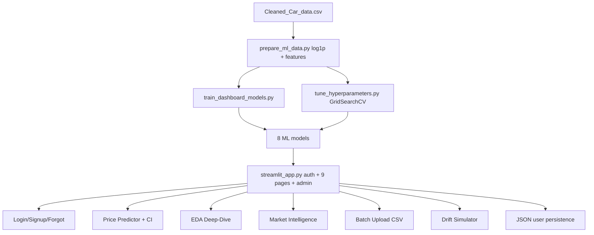
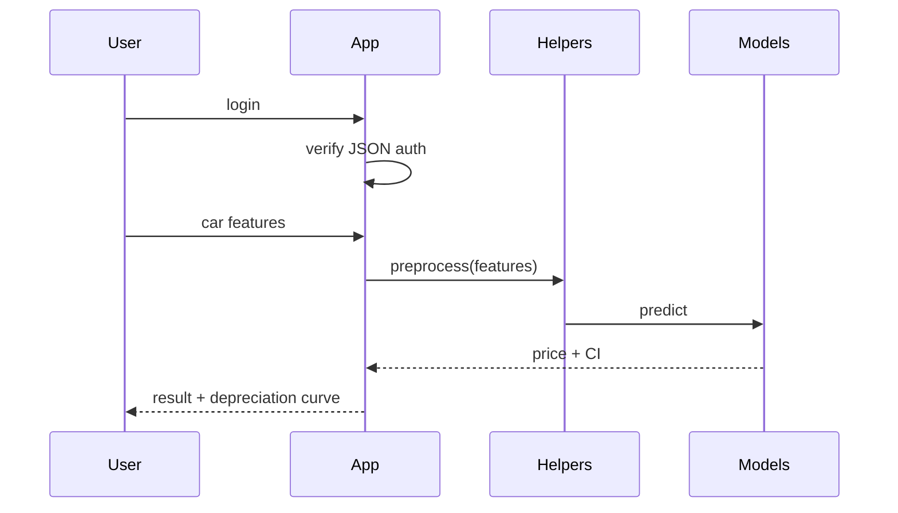
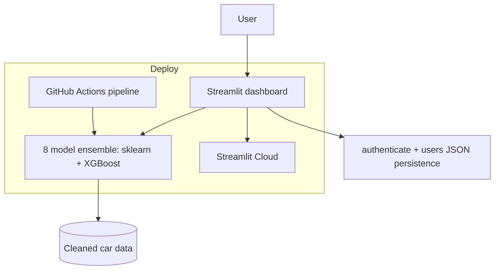
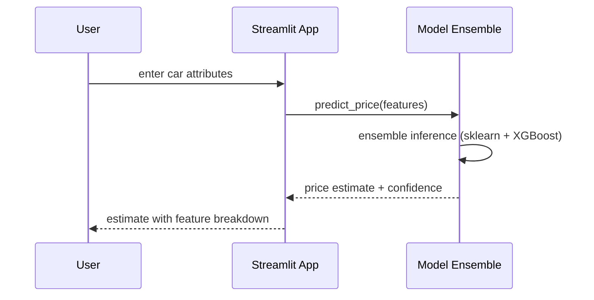

# TechSpec — AutoIntel: Technical Specification

| Field | Value |
| --- | --- |
| Version | v0.1 |
| Last Updated | 2026-08-06 |
| Owner | Engineering Lead |
| Status | In Review |

---

## 1. Architecture Overview

## 2. Tech Stack Table

| Layer | Technology | Version | Justification |
| --- | --- | --- | --- |
| Language | Python | 3.9+ | ML + Streamlit |
| ML | scikit-learn | 1.7 | 8 models |
| Boost | XGBoost | 3.2 | Ensemble |
| App | Streamlit | 1.57 | Dashboard |
| Data | pandas | — | EDA + prep |
| Persistence | JSON files | — | auth/users (lightweight) |
| Testing | pytest | — | 65 unit tests |
| CI | GitHub Actions | — | pipeline |

## 3. System Components

| Component | Responsibility | Inputs → Outputs | Scaling | Failure Modes |
| --- | --- | --- | --- | --- |
| prepare_ml_data.py | Preprocess + features | CSV → prepared | batch | dirty data |
| train_dashboard_models.py | Train 8 models | features → models | batch | none |
| tune_hyperparameters.py | GridSearchCV | models → tuned | batch | slow |
| streamlit_app.py | UI (9 pages + auth + admin) | user → pages | single-app | session reset |
| helpers.py | Pure helpers | args → result | in-process | none |
| JSON store | Users/predictions | CRUD → JSON | small scale | file locking |

## 4. Data Flow Diagrams

## 5. Third-Party Integrations

None — fully local/self-contained.

## 6. Non-Functional Requirements

| Category | Requirement | Target | How Verified |
| --- | --- | --- | --- |
| Accuracy | Test R² (best model) | ≥ 0.76 | benchmarks |
| Latency | Prediction | < 1s | app timing |
| Test health | pytest | 65 passing | CI |
| Portability | Single-file app | runs locally | docs |

## 7. Environments

| Env | URL | Data | Deploy |
| --- | --- | --- | --- |
| dev | localhost:8501 | CSV + JSON | manual |
| prod | Streamlit Cloud (target) | bundled | git push |

## 8. Error Handling Strategy

- Invalid input → form validation.
- Model missing → retrain guidance.
- Auth errors → clear messages.
- JSON store corruption → backup/seed fallback.

## 9. Observability

- App logs; session analytics (admin).

## 10. Technical Risks & Mitigations

| Risk | Mitigation |
| --- | --- |
| Model overfitting | CV + tuned params |
| Log-skew | log1p transform (documented win) |
| JSON concurrency | Low-scale; admin panel |

## Deployment Topology

## Sequence: Price Prediction

## 11. Related Documents

| Document | Relationship |
| --- | --- |
| [PRD.md](../product/PRD.md) | Requirements |
| [Schema.md](Schema.md) | Data model |
| [API.md](API.md) | Interfaces |
| [AppFlow.md](../design/AppFlow.md) | Flows |
| [Design.md](../design/Design.md) | UI |
| [ImplementationPlan.md](../project/ImplementationPlan.md) | Phases |
| [Tracker.md](../project/Tracker.md) | Status |
| [Rules.md](../project/Rules.md) | Standards |
| [SecurityAndCompliance.md](SecurityAndCompliance.md) | Auth |
| [Testing.md](Testing.md) | Tests |
| [Deployment.md](Deployment.md) | Environments |
| [Glossary.md](../reference/Glossary.md) | Vocabulary |
| [RiskRegister.md](../project/RiskRegister.md) | Risks |
